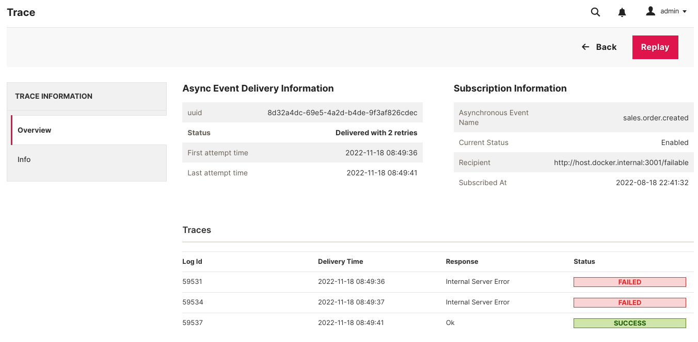

# Magento Asynchronous Events

A framework for handling reliable and asynchronous events with Magento.

* **Asynchronous**: The module uses RabbitMQ (or DB queues) to leverage asynchronous message delivery.
* **Flexible**: Decoupling events and dispatches provide greater flexibility in message modelling.
* **Scalable**: Handles back pressure and provides an asynchronous failover model automatically.

## Trace

All events are logged at the subscription level with a uuid. All information from the first delivery attempt to the latest attempt is presented as a trace table. The event payload is also available to view for debugging purposes.




## Retries

Events are automatically retried with exponential back off. The default retry limit is 5.

To change the default retry limit visit Admin > Stores > Settings > Configuration > Advanced > System > Async Events and update `Maximum Deaths`.


## Replays

An event can be replayed independent of its status. This is useful to debug or replay an event when all retries are exhausted. Replays start a new chain of delivery attempts and will respect the same retry limit if they fail again.


## Search Events

All events are indexed in Elasticsearch by default. This allows you to search through events including the event payload!

The module supports [Lucene Query Syntax](https://lucene.apache.org/core/2_9_4/queryparsersyntax.html) to query event data like attributes.

The following attributes are available

```
log_id
uuid
event_name
success
created
data
```

You can create complex lucene queries to fetch event history.

### Examples

Search all `sales.order.created` where the customer email is `roni_cost@example.com`

`data.data.customer_email: roni_cost@example.com`


Search all sales order events with the order increment id starting with `CK` and status success

`data.data.increment_id: CK* AND success: true`


## Getting Started

### Define an asynchronous event
Create a new file under `etc/async_events.xml`
```xml
<?xml version="1.0"?>
<config
    xmlns:xsi="http://www.w3.org/2001/XMLSchema-instance"
    xsi:noNamespaceSchemaLocation="urn:magento:module:Aligent_AsyncEvents:etc/async_events.xsd"
>
    <async_event name="sales.order.created">
        <service class="Magento\Sales\Api\OrderRepositoryInterface" method="get"/>
    </async_event>
</config>
```

### Create Subscription

#### HTTP Subscription
```shell
curl --location --request POST 'https://m2.dev.aligent.consulting:44356/rest/V1/async_event' \
--header 'Authorization: Bearer TOKEN' \
--header 'Content-Type: application/json' \
--data-raw '{
    "asyncEvent": {
        "event_name": "sales.order.created",
        "recipient_url": "https://example.com/order_created",
        "verification_token": "fD03@NpYbXYg",
        "metadata": "http"
    }
}'
```

#### Amazon EventBridge Subscription
Requires the [EventBridge Notifier](https://github.com/aligent/magento2-eventbridge-notifier)

```shell
curl --location --request POST 'https://m2.dev.aligent.consulting:44356/rest/V1/async_event' \
--header 'Authorization: Bearer TOKEN' \
--header 'Content-Type: application/json' \
--data-raw '{
    "asyncEvent": {
        "event_name": "sales.order.created",
        "recipient_url": "arn:aws:events:ap-southeast-2:005158166381:rule/Test.EventBridge.Rule",
        "verification_token": "aIW0G9n3*9wN",
        "metadata": "event_bridge"
    }
}'
```

### Dispatch an asynchronous event
```php
public function execute(Observer $observer): void
{
    /** @var Order $object */
    $object = $observer->getEvent()->getData('order');

    // arguments are the inputs required by the service class in the asynchronous
    // event definition in async_events.xml
    // e.g: Magento\Sales\Api\OrderRepositoryInterface::get
    $arguments = ['id' => $object->getId()];
    $data = ['sales.order.created', $this->json->serialize($arguments)];

    $this->publisher->publish(
        QueueMetadataInterface::EVENT_QUEUE,
        $data
    );
}
```
Ensure the following consumers are running

```shell
bin/magento queue:consumer:start event.trigger.consumer
bin/magento queue:consumer:start event.retry.consumer
```

## Advanced Usage
Refer to the [Wiki](https://github.com/aligent/magento-async-events/wiki)
